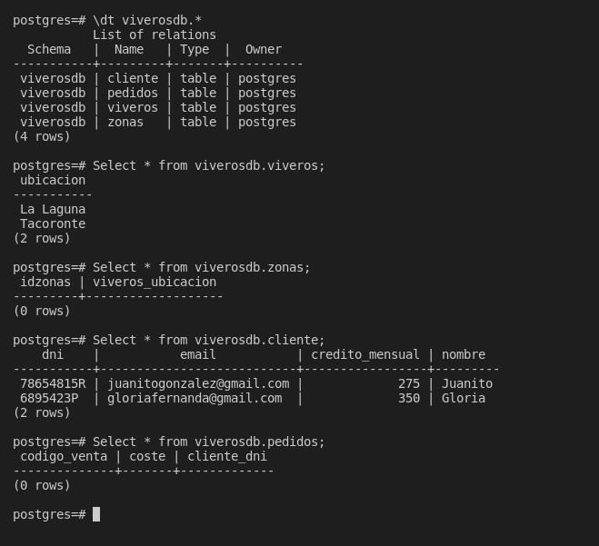

# Practica 3: Modelo Lógico Relacional: Viveros

El objetivo de esta práctica es aplicar el modelo lógico-relacional. Con este objetivo en mente, debes crear el esquema de la base de datos del diseño lógico empleando el software MySQL Workbench (https://www.mysql.com/products/workbench/) correspondiente al modelo conceptual de la empresa de viveros.

Debes entregar enlace a repositorio de GitHub que incluya al menos:

- [Imagen del diseño realizado con MySQL Workbench](ViverosModelo.png)

- [Modelo realizado con MySQL Workbench (fichero con extensión .mwb)](Viveros.mwb)

- [Script SQL generado para construir la base de datos (ficher con extensió .sql)](Viveros.sql)

- Imagen con la salida de un SELECT de cada tabla de la base de datos

